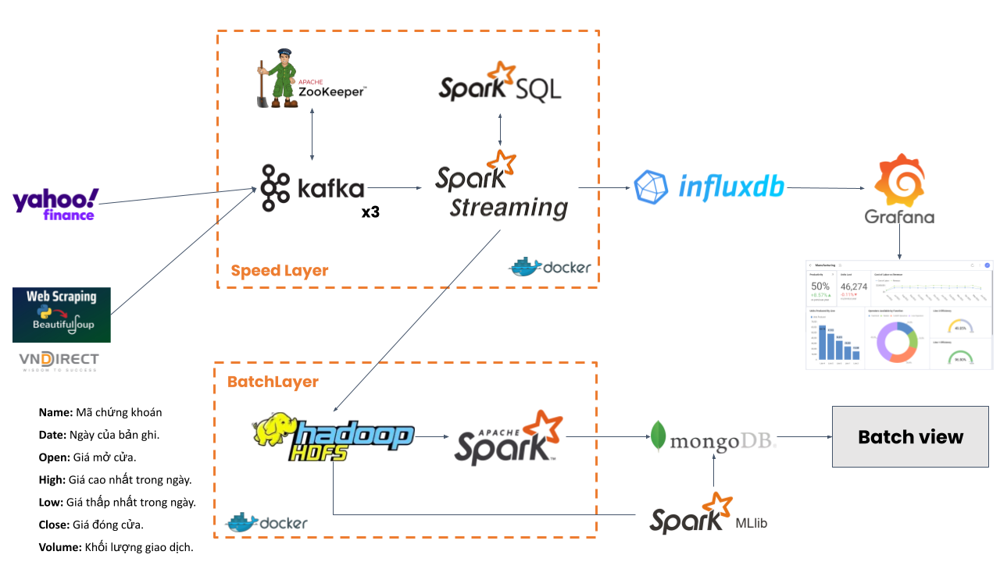

# Real-Time Stock Market Data Processing with Big Data Technologies

## Introduction
This project focuses on the real-time processing and analysis of stock market data using Big Data technologies. It aims to provide deep insights and timely information about market trends for effective investment strategies and risk management.

## Technologies Used
- **Docker**: For containerization and simulation of distributed environments.
- **Apache Kafka**: For managing and distributing real-time data streams.
- **Apache Spark & Spark Streaming**: For real-time data processing and analysis.
- **Apache Spark SQL & MLlib**: For data querying and machine learning tasks.
- **Hadoop HDFS**: For storage and batch processing of large datasets.
- **InfluxDB & Grafana**: For time-series data storage and visualization.
- **MongoDB**: For NoSQL data storage.

## System Architecture
The system uses a lambda architecture model, integrating both batch and stream processing for comprehensive data analysis. The architecture details can be found in the project report.



## Installation and Setup
Clone project source code:

```
git clone https://github.com/datphamvn/big-data-stock-analysis.git
```

Set up and change config (if necessary) at `config-hadoop` and `.env`
## Usage
To initialize and execute components in the Docker environment, use commands:
```
docker-compose --env-file ../.\.env up -d --remove-orphans --build
```


Launch producer
```
cd producer
python producer.py
```

The interface visualized through Grafana is displayed at:
`http://localhost:3000/`

## Contributors
- 20210158	Phạm Vũ Tuấn Đạt
- 20215472	Trần Cao Sơn
- 20215401	Trần Quang Khải
- 20210329	Hoàng Nghĩa Hiệp
- 20210784	Nguyễn Phúc Thắng


